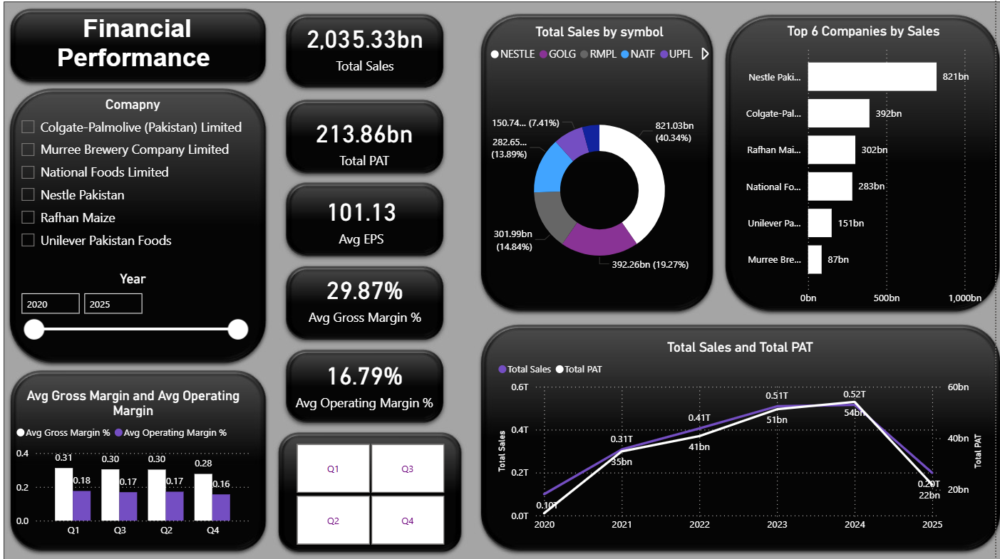
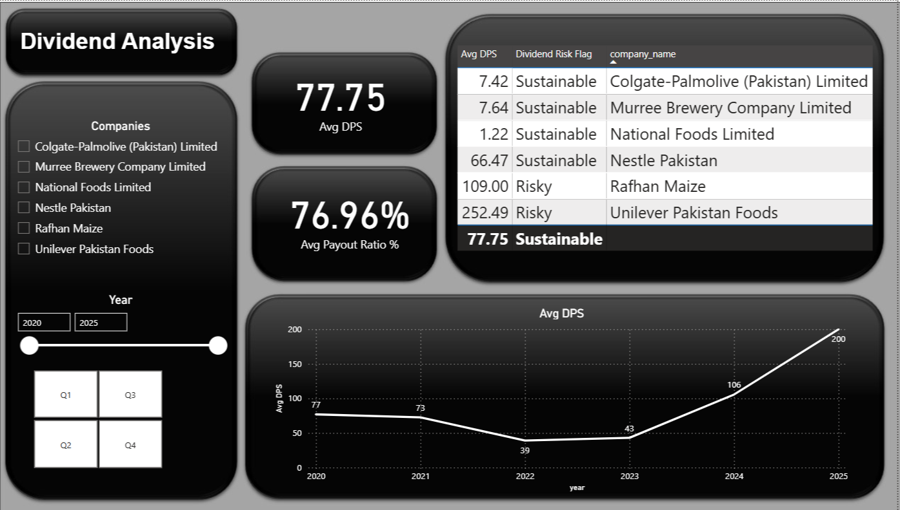
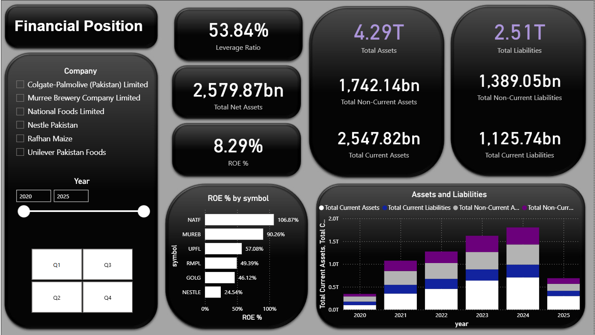

# 📊 FMCG Financial Analytics — Pakistan Stock Exchange (2020–2025)

> End-to-end Business Intelligence project analyzing dividend reliability, financial performance, and balance sheet strength of 24 FMCG companies listed on the Pakistan Stock Exchange using SQL Server, OLAP Data Marts, and Power BI.

---

## 📋 Table of Contents

<ul>
  <li><a href="#overview">Overview</a></li>
  <li><a href="#problem-statement">Problem Statement</a></li>
  <li><a href="#dataset">Dataset</a></li>
  <li><a href="#tools--technologies">Tools & Technologies</a></li>
  <li><a href="#methodology">Methodology</a></li>
  <li><a href="#key-insights">Key Insights</a></li>
  <li><a href="#dashboards--outputs">Dashboards & Outputs</a></li>
  <li><a href="#how-to-run-this-project">How to Run This Project</a></li>
  <li><a href="#results--conclusion">Results & Conclusion</a></li>
  <li><a href="#future-work">Future Work</a></li>
  <li><a href="#authors--contact">Authors & Contact</a></li>
</ul>

---

## Overview

This project is a full-cycle Applied Business Analytics solution built on financial data from 24 Fast-Moving Consumer Goods (FMCG) companies listed under the Food and Personal Care Products category of the **Pakistan Stock Exchange (PSX)**. The project spans a **six-year horizon (2020–2025)** — a period marked by the COVID-19 pandemic, historic currency devaluations, hyperinflation, and eventual market stabilization.

The solution follows a complete data pipeline: from **manual-digital hybrid data extraction** → **ETL & transformation in SQL Server** → **OLAP Data Mart design** → **Power BI dashboarding with DAX measures** — delivering actionable insights on dividend reliability, profitability trends, and balance sheet robustness.

---

## Problem Statement

The FMCG sector in Pakistan faced extreme financial pressure between 2020 and 2025, including:

- Operational disruptions from pandemic-era lockdowns
- Margin compression due to imported raw material cost surges
- Hyper-inflationary environment (2022–2024)
- Elevated interest rates challenging capital allocation decisions

Most companies in the sector struggled to maintain consistent shareholder returns during these periods. The key business question driving this project is:

> **Which FMCG companies on the PSX demonstrated genuine financial resilience — sustained profitability, consistent dividend payments, and balance sheet stability — across this turbulent six-year window?**

This project quantifies that resilience using structured KPIs across three analytical dimensions: **Operating Performance**, **Dividend Policy**, and **Balance Sheet Position**.

---

## Dataset

| Attribute | Details |
|-----------|---------|
| **Source** | Pakistan Stock Exchange (PSX) — Official Annual & Quarterly Reports |
| **Coverage** | 24 FMCG Companies (Food & Personal Care Products) |
| **Time Range** | 2020 – 2025 (Quarterly Granularity) |
| **Extraction Method** | Semi-manual AI-assisted hybrid (PDF annual reports + chairman's reports + audited financial notes) |
| **Primary Table** | `FMCG_FIN_OLTP.dbo.financials_fmcg` |
| **Format** | CSV → SQL Server (Flat File Import) |
| **Precision** | `DECIMAL(18,2)` for financials; `DECIMAL(5,2)` for margins/ratios |

### Companies Covered

| Category | Symbols |
|----------|---------|
| **Dividend Leaders** | NESTLE, UPFL, RMPL, MUREB, NATF |
| **Solid but Moderate Payers** | COLG, FCEPL, ISIL, SHEZ, ZIL |
| **Irregular / No Dividends** | ASC, PREMA, BFAGRO, BBFL, BNL, CLOV, FFL, MFFL, QUICE, SCL, TOMCL, TREET, UNITY, GLPL, MFL |

---

## Tools & Technologies

| Layer | Technology |
|-------|-----------|
| **Database (OLTP)** | Microsoft SQL Server — `FMCG_FIN_OLTP` |
| **Data Warehouse (OLAP)** | Microsoft SQL Server — `FMCG_FIN_OLAP` |
| **Query Language** | T-SQL (Window Functions, Aggregations, CTEs) |
| **BI & Visualization** | Microsoft Power BI Desktop |
| **Analytical Expressions** | DAX (Data Analysis Expressions) |
| **Data Modeling** | Star Schema / Denormalized Data Marts |
| **ETL** | Manual-Digital Hybrid + CSV Import Wizard |
| **Data Cleaning** | Regex-based scrubbing, formula recalculation, schema normalization |

---

## Methodology

The project is structured across four sequential phases:

### Phase 1 — ETL (Extract, Transform, Load)

- **Extraction:** Financial data extracted page-by-page from official PSX PDF annual reports using a semi-manual AI-assisted approach. Dividend announcements and EPS values were cross-verified against audited notes and chairman's reports.
- **Transformation:** Regex-based data scrubbing to remove non-numeric characters (e.g., `PKR`, `million`, `nil`); payout ratio recalculation to correctly distinguish cash vs. stock dividends; schema standardization with unified column naming and PKR-million unit normalization; temporal alignment across all 2020–2025 fiscal periods.
- **Loading:** Cleaned CSV files imported into SQL Server via the Flat File Import Wizard with strict data type mapping.

### Phase 2 — OLTP to OLAP

Three subject-oriented **OLAP Data Marts** were built in `FMCG_FIN_OLAP`:

| Data Mart | Focus Area | Aggregation Logic |
|-----------|-----------|------------------|
| `FinancialPerformanceMart` | Income Statement | `SUM` for financials; `AVG` for margins & EPS |
| `DividendPayoutMart` | Shareholder Returns | `AVG` for DPS, payout ratio, net assets/share |
| `FinancialPositionMart` | Balance Sheet | `SUM` for assets, liabilities, net assets |

All marts are grouped by `Symbol`, `Company_Name`, `YEAR(Period)`, and `LEFT(Fiscal_Quarter, 2)` to maintain quarterly grain.

### Phase 3 — Power BI & DAX

- Three OLAP marts imported into Power BI with a denormalized, performance-first data model.
- DAX measures developed for: Total Sales, Total GP, Operating Profit, PAT, Average EPS, Average GP Margin, Average OP Margin, Average DPS, Average Payout Ratio, Total Assets, Total Liabilities, Working Capital, Current Ratio, Debt-to-Assets Ratio, Equity Ratio.
- Interactive slicers added for `Company`, `Year`, and `Quarter`.

### Phase 4 — Analytical Dashboards

Three Power BI dashboards developed corresponding to each data mart, delivering executive-level financial insights with drill-through filters and visual storytelling.

---

## Key Insights

### Financial Performance
- Combined portfolio **Total Sales ≈ PKR 2,035 billion** with **PAT ≈ PKR 213.86 billion** across the analysis period.
- Average **Gross Profit Margin ≈ 30%** and **Operating Margin ≈ 17%** — reflecting strong pricing power among selected FMCG leaders.
- Sales and PAT grew consistently from 2020–2024, demonstrating robust post-pandemic recovery. The 2025 decline reflects partial-year data, not a structural downturn.
- **Market concentration is high** — Nestle, Colgate, Unilever, and Rafhan account for the majority of sector sales.

### Dividend Analysis
- Average **DPS ≈ PKR 77.75** with an average **Payout Ratio ≈ 77%** — indicating a mature, cash-generating sector.
- Dividend Leaders (NESTLE, COLG, MUREB, NATF) are classified as **sustainable payers** — earnings comfortably support distributions.
- RMPL and UPFL carry **elevated payout risk** due to high earnings allocation to dividends.
- Dividends dipped in 2022 under economic stress but recovered sharply post-2023, confirming that FMCG dividends are **earnings-driven, not debt-financed**.

### Financial Position
- Total Assets across selected firms exceed **PKR 4.29 trillion** against liabilities of **PKR 2.51 trillion** — yielding a leverage ratio of approximately **54%**.
- **Return on Equity ≈ 8.3%** overall; NATF and MUREB exhibit superior capital utilization.
- Asset base has grown steadily across all years with liabilities remaining in check — signaling **balance sheet fortification** over time.

---

## Dashboards & Outputs

The Power BI solution delivers three interactive dashboards:

| Dashboard | Data Mart Source | Primary KPIs |
|-----------|-----------------|-------------|
| **Financial Performance** | `FinancialPerformanceMart` | Sales, Gross Profit, PAT, EPS, GP Margin, OP Margin |
| **Dividend Analysis** | `DividendPayoutMart` | DPS, Payout Ratio, Net Assets Per Share |
| **Financial Position** | `FinancialPositionMart` | Current Assets, Non-Current Assets, Current/Non-Current Liabilities, Net Assets, Working Capital, Current Ratio, Debt-to-Assets |

All dashboards support dynamic filtering by **Company**, **Year**, and **Quarter**.

# Dashboards & Outputs

## Financial Performance Dashboard

<p align="center">
  
</p>

## Revenue & Profitability Dashboard

<p align="center">
  
</p>

## Financial Position Dashboard

<p align="center">
  
</p>

### Project File Structure

```
📁 FMCG-Financial-Analytics/
│
├── 📄 README.md
│
├── 📁 SQL/
│   ├── Financial_performance_mart.sql     # OLAP Mart 1 — Income Statement
│   ├── Dividend_payout_mart.sql           # OLAP Mart 2 — Dividend Policy
│   ├── Financial_position_mart.sql        # OLAP Mart 3 — Balance Sheet
│   ├── SQLQuery1.sql                      # OLTP validation queries
│   └── queries.sql                        # Analytical SQL queries (EPS QoQ, Top 5 Sales, Margin Trends)
│
├── 📁 PowerBI/
│   └── FMCG_Financial_Dashboard.pbix      # Power BI report file
│
├── 📁 Data/
│   └── financials_fmcg.csv                # Cleaned source data (OLTP input)
│
├── 📁 Documentation/
│   └── ABA_FINAL_REPORT.docx              # Full project report
│
└── 📁 Images/
    ├── Dashboard-1
    ├── Dashboard-2
    └── Dashboard-3


```

---

## How to Run This Project

### Prerequisites

- Microsoft SQL Server (2019 or later)
- SQL Server Management Studio (SSMS)
- Microsoft Power BI Desktop
- The cleaned source dataset: `financials_fmcg.csv`

---

### Step 1 — Set Up the OLTP Database

```sql
-- Create the OLTP database
CREATE DATABASE FMCG_FIN_OLTP;
```

Import `financials_fmcg.csv` into `FMCG_FIN_OLTP.dbo.financials_fmcg` using the **SSMS Flat File Import Wizard**. Ensure data types are mapped as:
- Financial values → `DECIMAL(18,2)`
- Company identifiers → `VARCHAR`
- Fiscal years → `INT`

---

### Step 2 — Create the OLAP Database

```sql
-- Create the OLAP database
CREATE DATABASE FMCG_FIN_OLAP;
```

---

### Step 3 — Build the Data Marts

Run the SQL scripts in the following order in SSMS:

```
1. SQL/Financial_performance_mart.sql    → Creates & populates FinancialPerformanceMart
2. SQL/Dividend_payout_mart.sql          → Creates & populates DividendPayoutMart
3. SQL/Financial_position_mart.sql       → Creates & populates FinancialPositionMart
```

Each script will `CREATE TABLE` and `INSERT` aggregated data from the OLTP source.

---

### Step 4 — Validate with Analytical Queries

Run `SQL/queries.sql` to verify:
- EPS quarter-over-quarter changes (Window Function)
- Top 5 companies by sales in the latest year
- Full sales and PAT trend by company
- Average GP and OP margins by year

---

### Step 5 — Connect Power BI

1. Open `PowerBI/FMCG_Financial_Dashboard.pbix` in Power BI Desktop.
2. Go to **Transform Data → Data Source Settings**.
3. Update the SQL Server connection to point to your local `FMCG_FIN_OLAP` instance.
4. Click **Refresh** to load data into all three dashboards.

---

## Results & Conclusion

This project confirms that within Pakistan's FMCG sector, **financial resilience and dividend consistency are tightly correlated**. The companies identified as Dividend Leaders — Nestlé, Unilever Pakistan Foods, Rafhan Maize, Murree Brewery, and National Foods — are also the most operationally efficient and balance-sheet-strong firms in the sample.

Key conclusions:

- A **30% gross margin floor** and disciplined cost management explain why dividend leaders could sustain payouts even during the 2022 inflationary shock.
- High payout ratios (>90%) are not inherently unsustainable if backed by strong free cash flow, but they leave minimal buffer during earnings downturns.
- The **majority of PSX-listed FMCG companies** did not pay regular dividends — pointing to structural challenges including excessive leverage, raw material import dependency, and reinvestment prioritization.
- The OLAP + Power BI architecture delivers a **scalable, query-efficient** analytical layer that can be extended to any new companies or time periods with minimal rework.

---

## 🚀 Future Work

- **Automate ETL:** Develop a Python-based web scraper targeting PSX financial disclosures to eliminate manual data extraction.
- **Expand Universe:** Include the full PSX FMCG sector (~50+ companies) beyond the current 24-company sample.
- **Predictive Modeling:** Build a dividend sustainability classifier using logistic regression or decision trees trained on historical payout ratios and earnings trends.
- **Real-Time Data Pipeline:** Integrate live PSX data feeds for up-to-date dashboard refresh.
- **Advanced DAX:** Add Year-over-Year and rolling 4-quarter trailing measures for richer trend analysis.
- **Benchmarking Layer:** Add sector-level aggregate benchmarks to contextualize individual company performance.

---

## Authors & Contact

### Moiz Ali Siddiqui — Student ID: 30743
[](https://www.linkedin.com/in/moiz-ali-4b9277276/)
[](mailto:moizali322@gmail.com)


---

**Faculty Advisor:** Sir Nasir Iqbal

**Institution:** Applied Business Analytics Program

**Project Type:** Final Academic Project — Business Intelligence & Data Warehousing

---

> *This project was developed as part of the Applied Business Analytics curriculum. All financial data is sourced from publicly available PSX annual reports and is used solely for academic analysis.*
